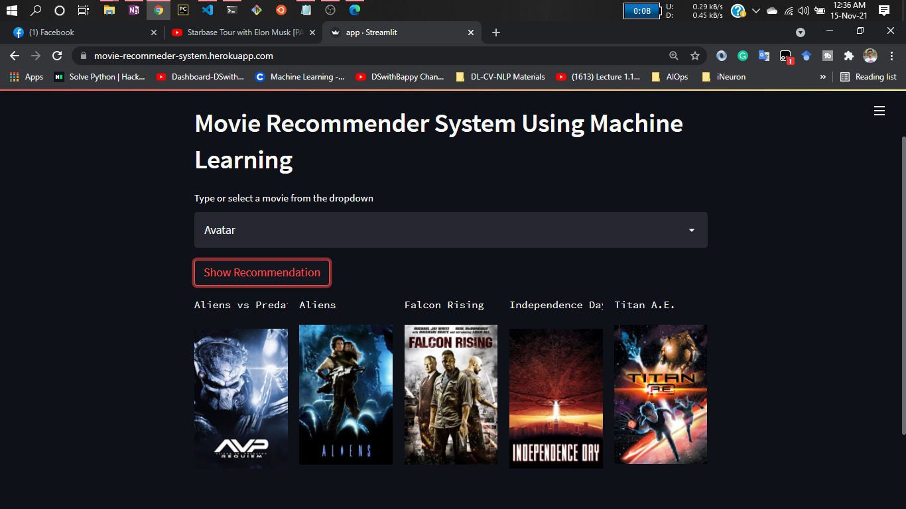
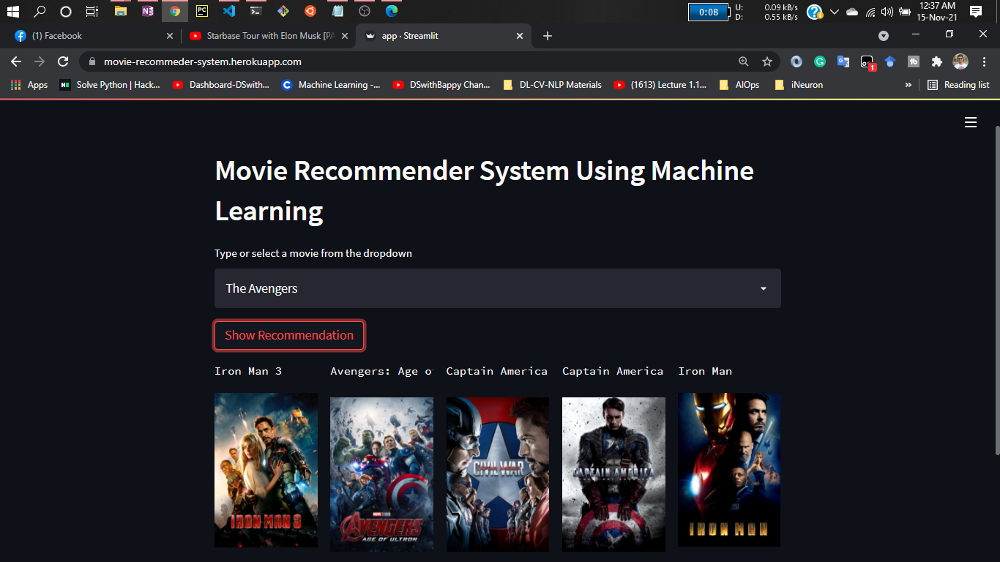

Movie Recommender System Using Machine Learning

In today's hectic environment, recommendation systems are becoming more and more crucial. Due to the numerous chores they must complete in the allotted 24 hours, people are constantly pressed for time. Because they assist them in making the best decisions without requiring them to use their cognitive resources, recommendation systems are crucial.

A recommendation system's primary function is to find stuff that a person might find interesting. Additionally, it incorporates a variety of elements to provide customized lists of relevant and engaging material tailored to each user or individual. Recommendation systems are algorithms based on artificial intelligence that quickly scan through every option and produce a personalized list of things that are relevant and intriguing to each user. These outcomes are determined by their profile, search/browsing history, what other people with similar traits/demographics are watching, and how likely are you to watch those movies. This is achieved through predictive modeling and heuristics with the data available.

# Types of Recommendation System :

### 1 ) Content Based :

- Content-based systems, which use characteristic information and takes item attriubutes into consideration .

- Twitter , Youtube .

- Which music you are listening , what singer are you watching . Form embeddings for the features .
	
- User specific actions or similar items reccomendation .
	
- It will create a vector of it .
	
- These systems make recommendations using a user's item and profile features. They hypothesize that if a user was interested in an item in the past, they will once again be interested in it in the future
	
- One issue that arises is making obvious recommendations because of excessive specialization (user A is only interested in categories B, C, and D, and the system is not able to recommend items outside those categories, even though they could be interesting to them).

### 2 ) Collaborative Based :
		
- Collaborative filtering systems, which are based on user-item interactions.
	
- Clusters of users with same ratings , similar users .
	
- Book recommendation , so use cluster mechanism .
	
- We take only one parameter , ratings or comments .
	
- In short, collaborative filtering systems are based on the assumption that if a user likes item A and another user likes the same item A as well as another item, item B, the first user could also be interested in the second item . 
	
- Issues are :

	- User-Item nXn matrix , so computationally expensive .

	- Only famous items will get reccomended .

	- New items might not get reccomended at all .   

### 3 ) Hybrid Based :
	
- Hybrid systems, which combine both types of information with the aim of avoiding problems that are generated when working with just one kind.

- Combination of both and used now a days .

- Uses : word2vec , embedding .           

# About this project:

This is a streamlit web application that can recommend various kinds of similar movies based on an user interest.
here is a demo,

(https://movie-recommeder-system.herokuapp.com/)

# Demo:

* [Dataset link](https://www.kaggle.com/tmdb/tmdb-movie-metadata?select=tmdb_5000_movies.csv)

1 . Cosine Similarity is a metric that allows you to measure the similarity of the documents.

2 . In order to demonstrate cosine similarity function we need vectors. Here vectors are numpy array.

3 . Finally, Once we have vectors, We can call cosine_similarity() by passing both vectors. It will calculate the cosine similarity between these two.

4 . It will be a value between [0,1]. If it is 0 then both vectors are complete different. But in the place of that if it is 1, It will be completely similar.

5 . For more details , check URL : https://www.learndatasci.com/glossary/cosine-similarity/

